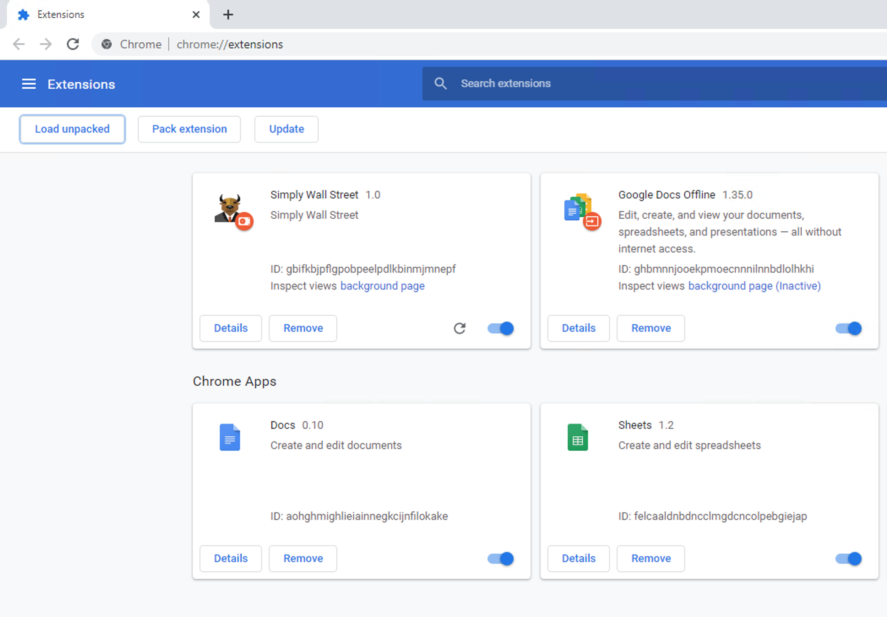

# simplywall.st-chrome-extension

### Details
* Chrome browser extension: allows using the web site https://simplywall.st/ on Free Plan with out restriction of 5 Company Reports per Month.
* The extension doesn't access to your Simplywall account and doesn't modificate nothing in Simplywall server, it's only hide the the Upgrade Plan modal window that bother to you to see the web page content.
* Go to [chrome://extensions/](chrome://extensions/) and choose **Load Unpacked** and select unzip extension folder and the extension will be installed.

### License
The project is released under the MIT License.
